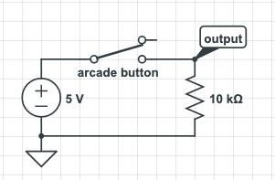

Arcade buttons are great to use in projects, but are a little confusing if you never used them before.
There are three connections on "COM" and two that are labeled "NO", but what do they do...

"COM" is as an input where you provide 5 volts to.
"NO" is used as the output, and there is two of them because one sends the signal when pressed down and other sends a signal when pressed released.

It is pretty simple, but confusing if you never used on before.
Here is a circuit diagram:



# Debounce.cpp
```c
#include "Debounce.h"

uint8_t _pin;
unsigned long _debounceDelay;
unsigned long _lastDebounceTime;
int _buttonState;
int _lastButtonState = LOW;

Debounce::Debounce(uint8_t pin, unsigned long debounceDelay) {
  _pin = pin;
  _debounceDelay = debounceDelay;
  _lastDebounceTime = 0;
}

void Debounce::attach() {
  pinMode(_pin, INPUT);
}

boolean Debounce::pressed() {
  int reading = digitalRead(_pin);

  if (reading != _lastButtonState) {
    _lastDebounceTime = millis();
  }

  if ((millis() - _lastDebounceTime) > _debounceDelay) {
    if (reading != _buttonState) {
      _buttonState = reading;

       if(_buttonState == HIGH) {
        _lastButtonState = reading;
        return true;
       }
    }
  }

  _lastButtonState = reading;
  return false;
}
```

## Debounce.h
```c
#ifndef Debounce_h
#define Debounce_h

#if defined(ARDUINO) && ARDUINO >= 100
  #include "Arduino.h"
#else
  #include "WProgram.h"
#endif

class Debounce {
  public:
    Debounce(uint8_t pin, unsigned long debounceDelay);
    void attach();
    boolean pressed();

    private:
      uint8_t _pin;
      unsigned long _dobounceDelay;
      unsigned long _lastDebounceTime;
      int _buttonState;
      int _lastButtonState;
};

#endif
```

## Example
```c
#include "Debounce.h"

Debounce button = Debounce(2, 50);

void setup() {
  Serial.begin(9600);

  button.attach();
}

void loop() {
  if (button.pressed()) {
    Serial.println("pressed")
  }
}

```
