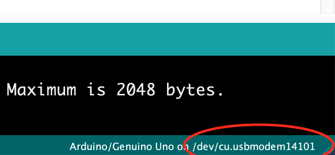

The port can be found in arduino studio. Example:


# pythonSerial.cpp
```c
int x;

void setup() {
  Serial.begin(115200);
  Serial.setTimeout(1);
}

void loop() {
  while (!Serial.available());
  x = Serial.readString().toInt();
  Serial.print(x + 1);
}
```

## ArduinoSerial.py
*Make sure you do not name the file `serial.py` or it will break `import serial`*
```python
# pip install pyserial

import serial
import time
# /dev/tty.usbmodem14101
arduino = serial.Serial(port='/dev/cu.usbmodem14101', baudrate=115200, timeout=.1)

def write_read(x):
    arduino.write(bytes(x, 'utf-8'))
    time.sleep(0.05)
    data = arduino.readline()
    return data

while True:
    num = input("Enter a number: ") # Taking input from user
    value = write_read(num)
    print(value) # printing the value


```

