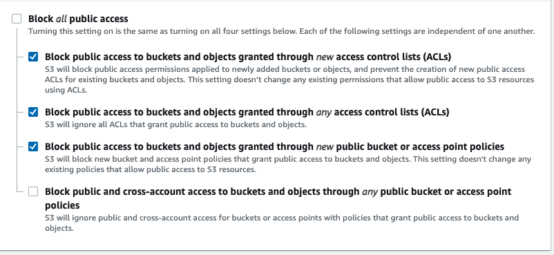

Update S3 bucket to have Block Public Access set to:


Update the buckets policy to:
```
{
    "Version": "2012-10-17",
    "Statement": [
        {
            "Sid": "PublicRead",
            "Effect": "Allow",
            "Principal": "*",
            "Action": [
                "s3:GetObject",
                "s3:GetObjectVersion"
            ],
            "Resource": "arn:aws:s3:::BUCKET_NAME/*"
        }
    ]
}
```

Do not forget to update *BUCKET_NAME*